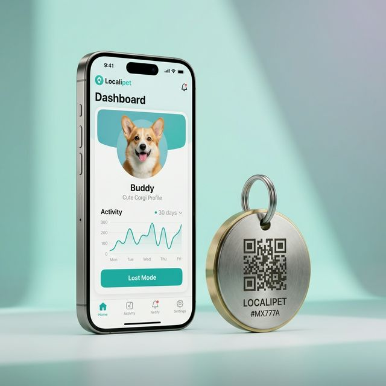
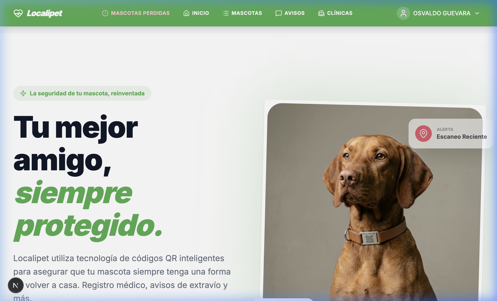
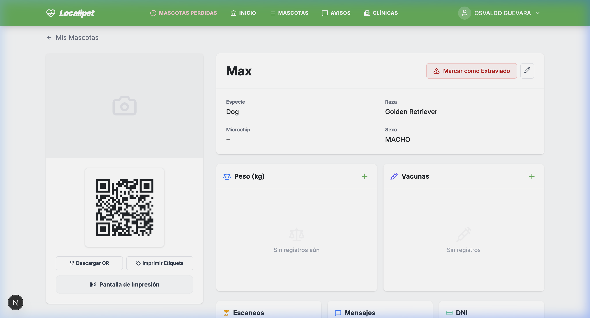
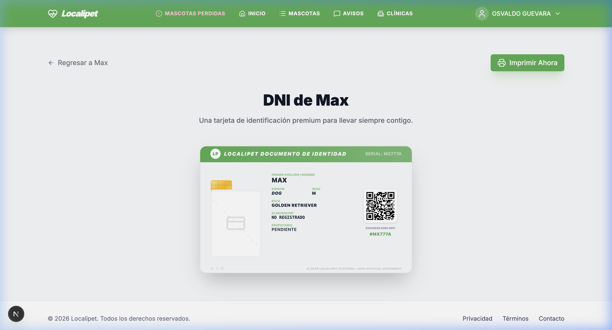
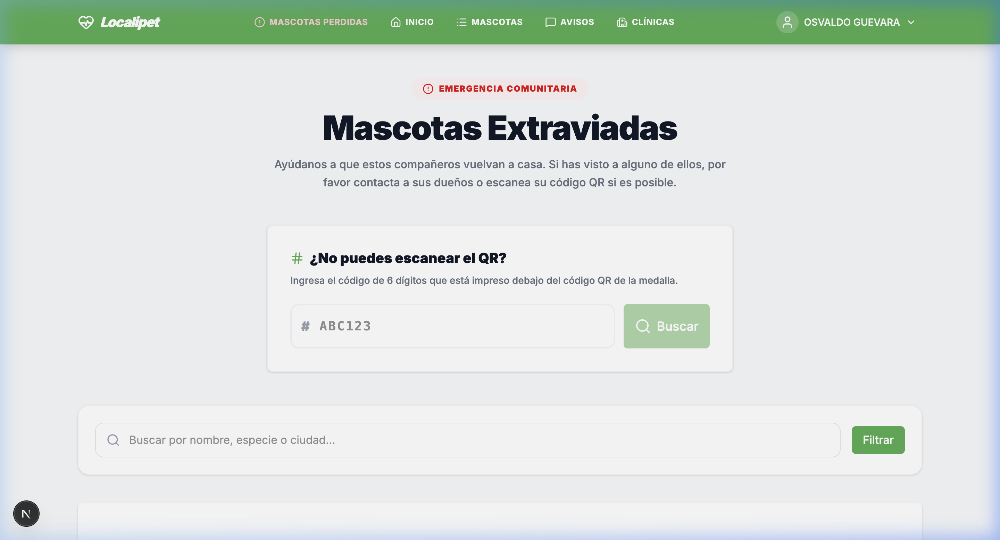
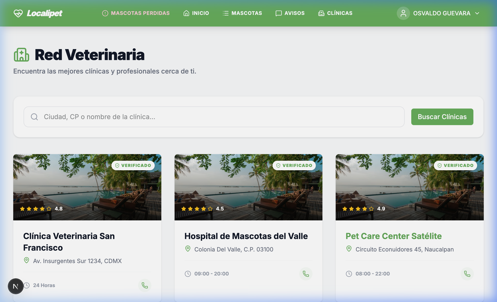
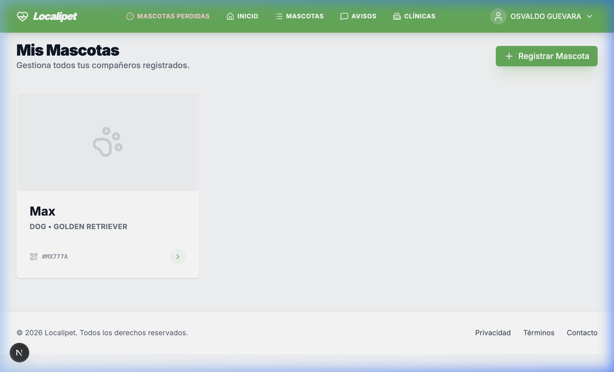

# 🐾 Localipet: Pitch Deck para Inversores y Socios

## 1. El Problema
Cada año, millones de mascotas se pierden. Las chapas tradicionales se borran, se caen o contienen información obsoleta. El proceso de recuperación es lento, estresante y a menudo ineficaz.

## 2. La Solución: Ecosistema Localipet
Localipet es una plataforma híbrida (Físico + Digital) que redefine la seguridad animal mediante **Tags Inteligentes** y una **Red de Recuperación Instantánea**.

---

## 3. Funcionalidades Core (Product Tour)

### 🚀 A. Landing Page & Búsqueda Omnicanal
Diseñada con un enfoque "Premium & Trust", nuestra puerta de entrada permite a cualquier ciudadano ayudar a una mascota en segundos.
*   **Búsqueda Manual**: Si el QR no es legible, el código alfanumérico `#ABC123` es la clave.
*   **Conversión Directa**: Flujo optimizado para que nuevos usuarios protejan a sus mascotas desde el primer segundo.

### 📲 B. Perfil Digital 360°
Transformamos una simple medalla en un expediente médico y de contacto dinámico.
*   **Historial de Salud**: Control de vacunas y peso.
*   **Modo Extraviado**: Activación de alertas con un solo clic.
*   **Privacidad Inteligente**: El dueño decide qué información mostrar en cada momento.

### 🪪 C. DNI Localipet (Documento Único de Identidad)
Nuestra funcionalidad estrella de fidelización.
*   **Identificación Portable**: Una tarjeta física que el dueño puede imprimir y llevar en su cartera.
*   **Estilo Premium**: Estética profesional que refuerza el compromiso del dueño con la seguridad de su mascota.
*   **QR Redundante**: Doble capa de seguridad (QR + Texto).

### 📢 D. Red de Alerta Comunitaria
Un centro de mando para mascotas desaparecidas.
*   **Alertas Geocalizadas**: Visualización de mascotas en peligro por zona.
*   **Escaneos con GPS**: Cuando alguien escanea un tag, el dueño recibe la ubicación exacta (con consentimiento del buscador).

### 🏥 E. Panel para Veterinarias y Clínicas
Localipet no solo es para dueños, es una herramienta profesional de gestión.
*   **Buscador Geocalizado**: Los usuarios encuentran clínicas verificadas cerca de su ubicación.
*   **Ficha Clínica Compartida**: Acceso instantáneo al historial de vacunas y peso durante la consulta.
*   **Sello de Confianza**: Las clínicas verificadas obtienen visibilidad prioritaria en la red.

### 🏬 F. Retail y Tiendas de Mascotas (Modo Tienda)
Integración total con el punto de venta físico.
*   **Activación en Caja**: El cliente compra la medalla física y la vincula a su mascota en segundos mediante el código QR "vacío".
*   **Gestión de Inventario**: Las tiendas pueden solicitar lotes pre-generados de tags listos para la venta.
*   **Fidelización**: El comercio se convierte en un punto de referencia para la comunidad Localipet local.

---

## 4. Escalabilidad y Negocio (B2B / B2C)

### 🏗️ Constructor de Tags (Módulo de Fábrica)
Hemos automatizado la cadena de suministro digital:
*   **Generación Masiva**: Capacidad para crear lotes de 1.000+ tokens únicos en segundos.
*   **Exportación a Fábrica**: Formatos CSV listos para grabado láser o impresión industrial.
*   **Activación Diferida**: El tag se fabrica y distribuye "vacío", vinculándose al usuario final en segundos durante la compra.

---

## 5. El Futuro: Visión 2026
*   **Expediente Veterinario Global**: Sincronización automática de pruebas y diagnósticos entre clínicas.
*   **Marketplace de Seguros y Salud**: Ofertas personalizadas basadas en el historial real del animal.
*   **IA de Diagnóstico Preventivo**: Notificaciones inteligentes basadas en patrones de peso y actividad.
*   **Localipet POS**: Terminal de venta específico para accesorios inteligentes en clínicas y tiendas.

---

**Localipet: Porque no buscamos mascotas, las traemos de vuelta a casa.**
